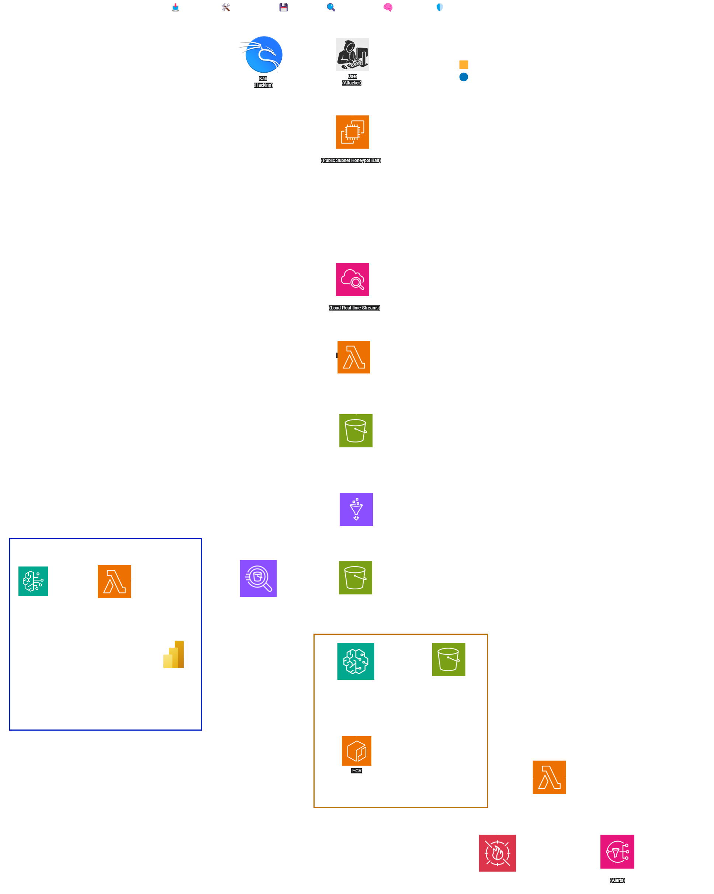

# darktracer-cloud-threat  

## Table of Contents  
1. [Introduction](#introduction)  
2. [Features](#features)  
3. [Architecture Overview](#architecture-overview)  
4. [Architecture Diagram](#architecture-diagram)  
5. [Technologies Used](#technologies-used)  
6. [Prerequisites](#prerequisites)  
7. [Setup & Deployment](#setup--deployment)  
8. [Usage](#usage)  
9. [Future Enhancements](#future-enhancements)  

## Introduction  
DarkTracer Cloud Threat is a cloud-native honeypot and threat detection pipeline designed to ingest, analyze, and visualize malicious activity in real-time. It uses AWS services to collect and process threat intelligence from honeypot environments, leveraging AI/ML for anomaly detection and automated incident response.

## Features  
- Serverless honeypot data ingestion pipeline using AWS Lambda and Kinesis  
- Threat data aggregation and storage using Amazon S3  
- Automated ML-based threat classification and detection  
- Real-time analytics and visualization with Athena and QuickSight  
- Automated incident response through WAF, Shield, and Lambda  
- Fully scalable and modular architecture  

## Architecture Overview  
1. Honeypot traps are deployed to collect malicious traffic (e.g., FTL or web attacks).  
2. Logs are ingested via CloudWatch and Kinesis Data Streams.  
3. Lambda functions parse and push data to S3.  
4. Data is optionally transformed via Glue.  
5. Athena runs queries for detection and dashboarding.  
6. A machine learning model detects anomalies.  
7. Automated remediation is triggered via Lambda, AWS WAF, and Shield.  
8. Insights are visualized using QuickSight.

## Architecture Diagram  

## Technologies Used  
- AWS CloudWatch  
- AWS Lambda  
- AWS Kinesis Data Streams  
- Amazon S3  
- AWS Glue  
- Amazon Athena  
- Power Bi
- Amazon SageMaker (or custom ML model container on ECS)  
- AWS WAF & AWS Shield  
- Python (for Lambda functions and ML model)  

## Prerequisites  
- AWS Account with sufficient IAM permissions  
- AWS CLI configured  
- Terraform or CloudFormation (optional, for IaC deployment)  
- Python 3.x (for custom scripts or local testing)  
- Basic familiarity with AWS services  

## Setup & Deployment  
1. Deploy honeypot agents and configure to send logs to CloudWatch.  
2. Provision the data pipeline using Terraform or manually:  
   - Set up Kinesis stream, Lambda ingestion, and S3 buckets  
   - Configure Glue crawlers and Athena tables  
3. Deploy ML model (SageMaker or ECS container)  
4. Set up QuickSight for dashboarding  
5. Enable WAF rules and Shield protections with response Lambda functions  

## Usage  
- Monitor data ingestion in CloudWatch and Kinesis  
- Run Athena queries for threat investigation  
- View dashboards in QuickSight  
- Review automated threat classifications from ML pipeline  
- Inspect triggered WAF/Shield responses in logs  

## Future Enhancements  
- Add real-time alerting via SNS/Slack  
- Integrate with AWS Security Hub or SIEM tools  
- Expand ML model to use external threat intelligence feeds  
- Support additional honeypot protocols (e.g., RDP, SMB)  
- Terraform module for one-click deployment  
